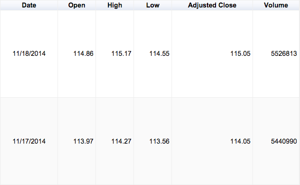
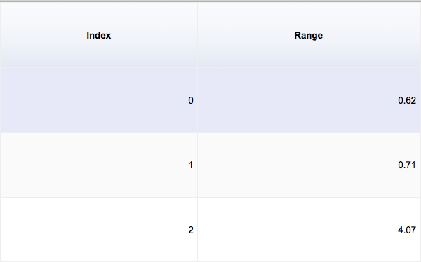

#Maps

Most bankers, whether they admit it or not are really high tech plumbers. They receive data; process it; and send it on to a fancy risk or aggregation system.

Extract, Transform and Load (ETL) takes up an inordinate amount of energy. Many do it manually in spreadsheets; some hire external companies; and others buy expensive products which claim to make the plumbing as efficient as possible.

##A Line of Code

You can use variations of this line of JavaScript to transform your spreadsheets and save a whole lot of time and money.

~~~~~~~~
rows
	.map(
		row => ( {openPrice: row['Open']} )
  		);
~~~~~~~~

While technically just one line, it's a little complex.

Firstly what is `rows`? This is an array of data, each object within it is a 'row' object, which is exactly how we view spreadsheets.

The column names are used as the 'keys' for each object.

So `row['Open']` (or indeed `row.Open`) gives us the open price on each row.

As the name implies, map takes input objects and maps them one by one over to output objects.

Always keep this in mind when you are about to take Map out of your mental toolbox - only use Map when you know the length of the output array will equal the length of the input array!

The Map function ends up returning,

`>> Array [ Object, Object, Object, ...]`

and each output object will look a little like this,

`>> {openPrice: "114.86"}`

A few extra lines of JavaScript, and we can output a one column CSV file, with the object key 'openPrice' as the single column's header. See an example application in action [here](https://storage.googleapis.com/blogjohnorfordcom/book/map/etl.html) and a test CSV drop file [here](https://storage.googleapis.com/blogjohnorfordcom/book/map/testDrop.csv).

Let's try something slightly trickier,

~~~~~~~~
rows
  	.map(
   		row =>
   		    ( {Range: row['High'] - row['Low']} )
  		);
~~~~~~~~

Now we calculate intra-day price ranges, by taking a row's low figure from the daily high.

##Extras

Sometimes, you need to know about where each element is relative to the others, JavaScript adds an index feature into its implementation of map which keeps track of an element's current placing.

~~~~~~~~
rows
	.map(
   		(row, i) =>
   		    ( {Index: i, Range: row['High'] - row['Low']} )
  		);
~~~~~~~~

The `i` variable keeps track of each element's current index and we output using an 'Index' key in our object.

As well as keeping track of relative order each map can also have an eye on the `rows` array as a whole. E.g.

~~~~~~~~
rows
  	.map(
   		(row,i,a) =>
   		    ( {Index: a.length-i, Range: row['High'] - row['Low']} )
  		);
~~~~~~~~

Now our index will count down to zero, as the new `a` variable represents `rows` within the mapping logic.

##Plumbing

The example application above shows how one line of mapping logic can be so powerful. Dragging and dropping a CSV file onto your browser results in a file tailored precisely to your needs.

While many in finance would bristle at their work being likened to plumbing, we will see in the next chapter how computer scientists have wholeheartedly embraced the plumbing metaphor.

##More Info

[Maps](https://en.wikipedia.org/wiki/Map_(higher-order_function)) on Wikipedia.

Mozilla's [JavaScript Map reference](https://developer.mozilla.org/en/docs/Web/JavaScript/Reference/Global_Objects/Array/map).

##Try

1) [Download the example application](https://storage.googleapis.com/blogjohnorfordcom/book/map/map%20example.zip) and modify it to map either your own CSV files or those downloaded from Yahoo! or Google Finance (best test with a recent Firefox, Chrome for example doesn't allow some JavaScript features when using local HTML files)

2) How would you go about enforcing a specified input file format?  So that the program could point out problems when it's dropped and avoid frustration later on.

3) Browse the [Eloquent JavaScript book](http://eloquentjavascript.net/1st_edition/contents.html)
