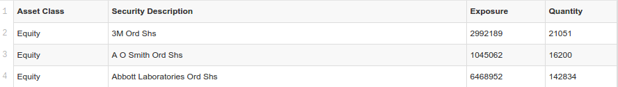

#Reduce

Until now we have introduced a handful of new concepts which needed just two pieces of vocabulary - `map` and `filter`.

`reduce` is a new piece of vocabulary and one of the most powerful concepts in computer science rolled into one!

Similar to the idea of 'optionality' in quantitative finance, once you understand that `reduce` is fundamental you begin to see it everywhere.

But let's begin with something more down to earth - summarising a [portfolio holdings file](https://github.com/mmport80/JavascriptFinanceBook/blob/master/manuscript/code/chapter%2004%20-%20reduce/testDrop.csv) from AQR's Large Cap Momentum Fund.

##Beginner's Origami

~~~~~~~~
rows
 .reduce(
  (total, row) =>
   +row.Exposure + total
  , 0
 );
~~~~~~~~

This line of code calculates the total exposure of a fund, you can run and download the demo from the [code repository on GitHub mentioned in the introduction](https://github.com/mmport80/JavascriptFinanceBook/blob/master/manuscript/code/chapter%204%20-%20reduce/reduce.zip).

`reduce` takes three main arguments.

Starting from the bottom. The initial value. Seeing as we are calculating the total exposure, we start at zero and sum upwards.

Next, a function which takes two arguments.

The first `total` variable stores the current running total.

The `row` variable represents the current row of data.

Every time we `return`, we add to the current running total.

In this case we find the `Exposure` figure for each stock holding (the `+` suffix converts text to numbers in JavaScript) and then adds it to `total`.

Let's tweak the code to further describe the portfolio.

~~~~~~~~
rows
 .reduce(
  (top, row) =>
   +row.Exposure > +top.Exposure ?
    row
    :
    top
 );
~~~~~~~~

This will return the row or stock with the largest exposure.

The 'running total' is now an object. By default, if no initial value is declared, the first element in the array will be used. In this case a row object.

We update `top` if a current row's exposure is greater than our current highest row.

No surprise that the largest holding in August 2015 is Apple at $68m.

##Efficiency

Let's combine the first two examples and see how much of the portfolio is comprised of REITs.

~~~~~~~~
rows
 .reduce(
  (total, row) =>
   row['Security Description'].includes('REIT') ?
    +row.Exposure + total
    :
    total
  , 0
 );
~~~~~~~~

If the row's security description field contains the word 'REIT' we add the current row's exposure, otherwise it remains as before.

Lastly, let's combine all three examples together in one `reduce`.

~~~~~~~~
rows
 .reduce(
  (results, row) => 
   (
    {
    'Total': totalExp( results['Total'], row ),
    'Top': topExp( results['Top'], row ),
    'REIT': reitExp( results['REIT'], row )
    }
   )
  , {   
    'Total': 0,
    'Top': {Exposure:-Infinity},
    'REIT': 0
    }
 );
~~~~~~~~

Beginning at our initial values. As before, our total and REIT exposures begin at `0`; our top exposure now begins at minus infinity (just in case we encounter short positions).

We now have an object of initial values, and we return an object matching this template as we step through each row.

You will notice also that we have named functions for each set of logic. `totalExp` looks like this for example:

~~~~~~~~
totalExp =
 (total, row) =>
  +row.Exposure + total;
~~~~~~~~

which helps keep everything tidy.

The upshot?

`reduce` can be incredibly efficient and succinct. We are summarising the data in three different ways with just one pass through!

##Fundamental

As alluded to previously, `reduce` is perhaps *the* fundamental building block of functional programming, but much more than that, it is incredibly useful too!

We will explore more applications of `reduce` in the coming chapters and along the way uncover some more of its deep secrets.

##More Info

1) Mozilla's `reduce` [documentation](https://developer.mozilla.org/en-US/docs/Web/JavaScript/Reference/Global_Objects/Array/Reduce) for JavaScript. Note the optional extra index and array inputs.

2) Graham Hutton's [Tutorial](http://www.cs.nott.ac.uk/~pszgmh/fold.pdf) on the universality and expresiveness of fold.

##Try

1) Modify the example application to summarise some of your own spreadsheets.

2) Rather than just reporting the top exposure, try reporting the top five exposures.

3) Reinterpret the `map` and `filter` functions just using `reduce`!
