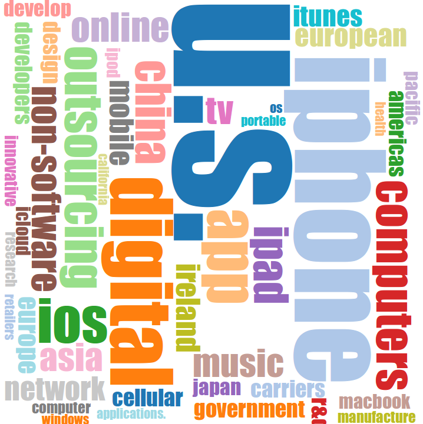

#D3

D3 is a foreboding beast.

It eschews classic programming styles in favour of a more functional approach.

Luckily however, if you have come this far, get ready to sit back and enjoy of the fruits of your labour.

Almost every charting library is prescriptive, they give you several chart templates which you can configure and populate with data.

D3 is much more ambitious. It's descriptive, giving you all the tools to transform data into your own custom visualisations.

In our case, a word cloud based on Apple's September 2015 quarterly report.

##Pipes

While D3 is complex, a large part of the initial confusion comes from it's not-so-common-declarative-style, aka piping.

We have utilised pipes again and again in this book, so the learning curve should be gentle. Nevertheless, D3's piping implementation gives us a new angle on the technique.

Instead of arrays of data flowing through D3's pipes, D3 objects flow through. 

~~~~~~~~
d3
 .select("body")
 .append("svg")
~~~~~~~~

D3 code builds up SVG (Simple Vector Graphic) visualisations layer by layer. 

First we select the HTML tag to append to, in this case the `body` tag, then we append a `svg` tag, under which we we add the graphical details.

`d3` is the initial D3 object - a blank slate. We take our D3 object and transform it by piping (or 'chaining') it through functions.

~~~~~~~~
d3
 .select("body")
 .append("svg")
  .attr("width", height)
  .attr("height", height)
~~~~~~~~

Think of our SVG tag as a canvas, we need to set the canvas area, and do so through the height and width attributes. In this case, our canvas is a square `height*height` pixels squared.

##Select & Enter

The other key idea in D3 is joining data to visual elements or tags on a web page.

In the following code we append a 'group' tag and then setup our selection, to select all SVG 'text' tags.

~~~~~~~~
d3
 .select("body")
 .append("svg")
  .attr("width", width)
  .attr("height", width)
  .append("g")
   .selectAll("text")
   .data(words)
   .enter()
~~~~~~~~

`words` contain our data - we are about to build a word cloud.

Wait! We haven't appended any `text` tags to our page.

Actually, this is usually the case with D3, select rules are put in place before we append, which should remind you of the chapter on 'decomposing' or 'currying' functions. Once the triumvirate of `selectAll`, `data` and `enter` is set the `selectAll` method lingers out in the wilderness until we give it the required `text` elements to attach data to.

This means we don't need one large method which accepts every possible input, we can break down our description of the visualisation in a more logical manner.

~~~~~~~~
...
.append("g")
 .selectAll("text")
 .data(words)
 .enter()
 .append("text")
  .style("font-size", word => word.size + "px")
  .style("fill", (word, index) => fill(index) )
~~~~~~~~

As we append each `text` element we set each element's `style` parameters. When setting `font-size` note that `word` represents each individual 'datum' of the data passed through. Here we can see that `words` is really an array of 'word' objects, one parameter of which is `size` in pixels.

The next style parameter sets the fill colour. `fill` takes an integer. `index` denotes where the `word` object comes in the `words` array. `index` is optional, which is why you don't see it at all in when setting `font-size`.

In fact, we don't necessarily need to set SVG tag attributes using data, e.g. when setting where our text should 'anchor',

~~~~~~~~
...
.append("text")
 .style("font-size", word => word.size + "px")
 .style("fill", (word, index) => fill(index) )
 .attr("text-anchor", "middle")
~~~~~~~~

Now let's position each word.

~~~~~~~~
...
.append("text")
 .style("font-size", word => word.size + "px")
 .style("fill", (word, index) => fill(index) )
 .attr("text-anchor", "middle")
 .attr("transform", word => "translate(" + [word.x, word.y] + ")rotate(" + word.rotate + ")")
~~~~~~~~

The SVG `transform` attribute uses two SVG functions. The first `translate` sets where our canvases origin is (SVG's default origin is the top left corner). The second `rotate` is obvious.

Now we know our `word` objects contain positioning and rotation information, there's only one piece missing.

~~~~~~~~
...
.append("text")
 .style("font-size", word => word.size + "px")
 .style("fill", (word, index) => fill(index) )
 .attr("text-anchor", "middle")
 .attr("transform", word => "translate(" + [word.x, word.y] + ") rotate(" + word.rotate + ")")
 .text( word => word.text)
~~~~~~~~

As you can see, we are not individually setting each piece of text, rather we are declaratively setting out the rules which each piece of text should obey as its being laid out.

##Result

Along with a little text parsing code, a rather nifty script called [D3-Cloud](https://github.com/jasondavies/d3-cloud) helps to fit our words together neatly on our SVG canvas by supplying the `x`, `y` and `rotate` positioning data.

While often overlooked, such qualitative analysis is a big topic, which helps us understand what product lines, markets and issues a company views as important. Aggregating such information across a portfolio of companies give portfolio managers a descriptive view of risk in a way which gets lost in quantitative noise.

##Summary

D3 is perhaps the JavaScript's most successful library. Mike Bostock, D3's creator, is extremely thoughtful which is immediately obvious once you spend any time with D3 or come across his writings.

While D3 is often seen as complex, after picking up the functional concepts in this book you can better appreciate the design decisions and approach it takes.

##More Info

1) Need a good tutorial on D3? Try [Dashing D3](https://www.dashingd3js.com/table-of-contents)

2) [Take a gander](https://github.com/mbostock/d3/wiki/Gallery) at the wide variety of visualisations possible

##Try

1) Take a look at this [histogram tutorial](http://bl.ocks.org/mbostock/3048450), and use the Apple data to populate it

2) Add tool tips to the word cloud example which show number of mentions