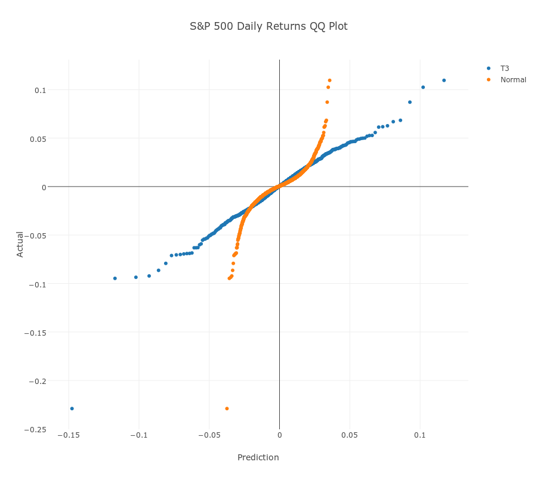

#Statistics

Finance is a super slow mo movie of investment decision logic colliding into chaotic markets. The narrow space in between is inhabited by statistics.

JavaScript has a capable statistics library called jStat which offers a wide range of statistical functions, as well as some very neat features.

##Async

jStat supports asynchronous function calls out of the box, which means we can string several statistical operations together and ensure they do not step on each other's toes.

This is particularly useful for large datasets.

For example, perhaps we want to estimate parameters from a very large matrix or vector (100 million columns by 1 row). 

~~~~~~~~
const rnmds = jStat().rand(1,100000000);
~~~~~~~~

`rand` populates our vector with random numbers.

Rather than estimating the mean and standard deviation individually, you can calculate the parameters asynchronously by chaining methods together.

~~~~~~~~
rndms
 .mean( x => console.log(x) )
 .stdev( x => console.log(x) );
~~~~~~~~

If we set up our usual 'postbox' generator function, we can calculate and then collate the result like so,

~~~~~~~~
const postBox = function*(){  
 const firstMessage = yield;
 const secondMessage = yield;              
 //merge objects
 const result =  Object.assign(firstMessage, secondMessage);
 console.log(result);
 }
~~~~~~~~

Initialising our `postBox` generator is simple.

~~~~~~~~
const send = postBox();
send.next();
~~~~~~~~

Now, we just need to tweak our jStat callback functions a little. Along with the result we will send a label so our postbox function know who sent the message.

~~~~~~~~
rndms
 .mean( x => send.next( {mean: x} ) )
 .stdev( x => send.next( {sd: x} ) );
~~~~~~~~

##Decomposable Functions

jStat functions are decomposable too, i.e. we have a means to pass around parameterised distributions as variables.

For example,

~~~~~~~~
const n = jStat.normal(0,1);
~~~~~~~~

lets us do things like this later on

`n.median()`

`>> 0`

and this

`n.variance()`

`>> 1`

##Pipes

As well as asynchronous piping, we can also pipe in the usual manner, for example,

~~~~~~~~
const percentiles = jStat(
 0.01, 
 0.99, 
 99
);
~~~~~~~~

generates a jStat object array with 99 numbers, starting with 0.01 and ending with 0.99.

Then,

~~~~~~~~
percentiles
 .normal(0,1)
 .inv();
~~~~~~~~

returns the values of the standard normal distribution at each of the given percentiles.

##Bringing It All Together

Let's create some predictive models then compare them against the actual data.

First step is to pull down the data from Quandl and then generate actual returns. This is done using the usual 'postbox' pattern discussed before. These returns are the benchmark for our predictive models.

Then find our model's parameters,

~~~~~~~~
const sd = jStat(actualReturns).stdev(true);
const mean = jStat(actualReturns).mean();
const dof = 3;
~~~~~~~~

Use the `mean` in turn to demean our returns,

~~~~~~~~
const demeanedActualReturns = jStat(actualReturns).subtract(mean)[0];
~~~~~~~~

Generate percentiles as above and then generate the model data.

Our normal model is as before,

~~~~~~~~
const normalPredictions = percentiles
 .normal(0,sd)
 .inv()[0];
~~~~~~~~

The Student's T is as follows,

~~~~~~~~
const studentPredictions = percentiles
 .studentt(dof)
 .inv()[0]
 .map(
  n => 
   n *
   sd *
   Math.sqrt(  ( dof - 2 ) / dof )
  );
~~~~~~~~

The `map` at the end takes each realisation of the Student T distribution (`n`) and scales it so it is comparable to our return data.

When we calculate the R2 for each model against the data,

~~~~~~~~
Math.pow( jStat.corrcoeff( demeanedActualReturns, normalPredictions ), 2)
~~~~~~~~

`>> 0.8962...`

~~~~~~~~
Math.pow( jStat.corrcoeff( demeanedActualReturns, studentPredictions ), 2)
~~~~~~~~

`>> 0.9765...`

we see that the T distribution with 3 degrees of freedom captures 98% of the daily movements over the last 65 years, whereas the normal distribution only captures 90%.

When we plot the results against the actual returns the R2 results are obvious,

The normal distribution underestimates both large drops and jumps, whereas the Student T distribution keeps its grips on a slope of 1 with far greater fluctuations.

It only starts veering away from reality during a handful extremely violent crashes. The largest daily drop of the S&P 500 over the past 65 years is 23% whereas the model predicts the largest drop to be a mere 15%.

##Summary

Not only does jStat have a decent statistical coverage, but it packages everything up in a practical manner which means we can achieve a lot both in less time and fewer lines of code.

Far tidier than the equivalent Excel spreadsheet.

##More Info

1) jStat documentation is [here](https://jstat.github.io/)

2) Scaling Student T distribution [note](https://en.wikipedia.org/wiki/Student%27s_t-distribution#In_terms_of_scaling_parameter_.CF.83.2C_or_.CF.832)

##Try

1) We calculate volatility from looking back at all the data, how about tweaking the code to make each day's prediction based on the previous year's returns instead?

2) Incorporate asynchronous jStat calculations, aggregate the results, and when done, plot
