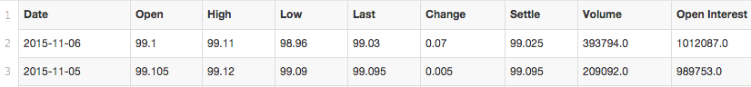
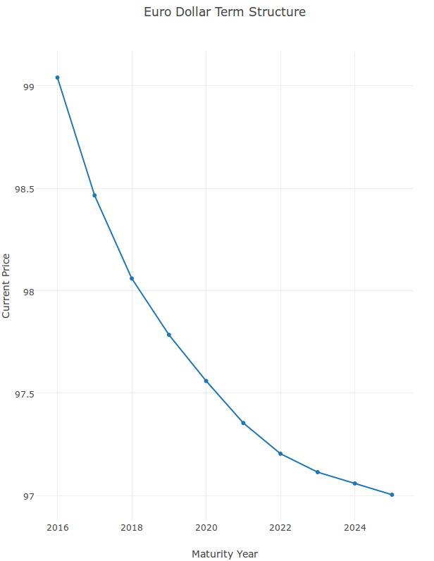
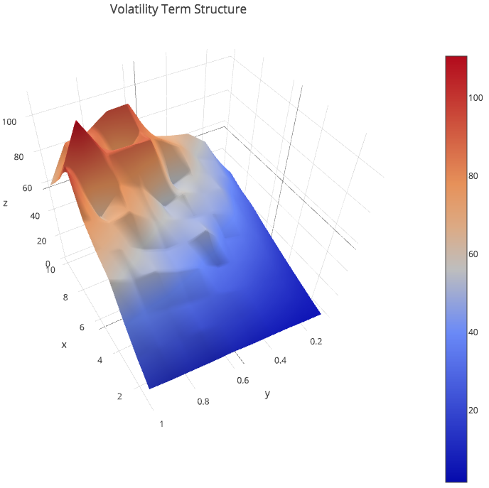

#Visualisation

The web dominates our communication. The driver of this crushing victory? The humble webpage increasingly coupled with JavaScript.

Up until now we have focused on the basics of how to code JavaScript in a functional manner, now for some fun. The next chapters will explore JavaScript's rich ecosystem of libraries.

The rise of the web means cutting edge visualisation techniques are web based, and almost all are based on a single library.

D3 stands for 'Data Driven Documents', its flexibility provides a canvas from which other simpler libraries can be built upon.

Let's look at one such library now.

##Plotly

The [Plotly library](https://plot.ly/javascript/) provides twenty or so charts which we can use in a variety of situations.

Creating a new chart is easy.

~~~~~~~~
Plotly.newPlot(graphDiv, data, layout);
~~~~~~~~

The `newPlot` function inserts a chart in under the `graphDiv` element in the html page.

E.g.

~~~~~~~~
const graphDiv = document.getElementById('graph');
~~~~~~~~

will reference this part of our HTML page,

~~~~~~~~

~~~~~~~~

The data variable is an array of 'trace' objects, basically a data time series, e.g.

~~~~~~~~
const trace = {
 x: sortedData.map( y => y.year ),
 //latest settle price
 y: sortedData.map( y => y.data[0].Settle )
 }
~~~~~~~~

which shows our x axis will comprise of future contract maturity 'years', and the latest settlement price. Our future contract data is pulled from Quandl and looks like this,

Layout is optional, but we better note down our axes and chart title.

~~~~~~~~
const layout = {
 title: "Euro Dollar Term Structure",
 xaxis: { title:"Maturity Year" },
 yaxis: { title:"Current Price" }
 };
~~~~~~~~

The result looks like this (with a lot more interaction!)

The pattern we use to retrieve the information is similar to the one we used in the asynchronous chapter - i.e. we utilise generator function 'postboxes'.

~~~~~~~~
const postBox = function*(previousData){
 const newData = yield;
 
 const combinedData = previousData.concat(newData);
 const sortedData = combinedData.sort( (a,b) => a.year > b.year);
 ...
 Plotly.newPlot(
  graphDiv,
  [ trace ],
  layout
  );
 yield* postBox(sortedData);
}
~~~~~~~~

As per usual, we assign a variable to any messages we receive using the `yield` keyword. In this case we call each message `newData`.

We concatenate `newData` to any `previousData` we received, and sort it by year. Initially `previousData` is empty, i.e. `[]`.

Then simply call the `Plotly.newPlot` function.

Lastly we recursively call the postBox function with the latest `sortedData` array. Note how you call generator functions, by using the `yield*` keyword.

This means we can send as much data as we want to our `postBox` generator function and it will both update the graph and accumulate the data; in our case we send api calls to Quandl for each future contract and then slot the reply into our `postBox`,

~~~~~~~~
d3.csv(
 "https://www.quandl.com/api/v3/datasets/CME/EDU"+year+".csv",
 data => send.next( {year: year, data: data} )
 )
~~~~~~~~

Download the full code and play around with it [here](https://github.com/mmport80/JavascriptFinanceBook/blob/master/manuscript/code/chapter%2009%20-%20visualisation/visualisation.zip).

##Going 3D

Now for something a little more complex. The last chapter covered a way to numerically approximate European options using the Monte Carlo method.

How about visualising the reliability of the Monte Carlo method by displaying the results in 3d?

To do this we will price 100 different call option contracts with various expiries and volatilities. Specifically, combinations of these inputs,

~~~~~~~~
const expiries = [1,2,3,4,5,6,7,8,9,10];
const volatilities = [0.1,0.2,0.3,0.4,0.5,0.6,0.7,0.8,0.9,1];
~~~~~~~~

As in the previous chapter, each contract is concurrently processed by a web worker.

~~~~~~~~
expiries.map(
 e => volatilities.map(
  v => c(110, 100, v, e, 0.01)
  )
);
~~~~~~~~

This means we create 100 web workers (use FireFox to run this code from your desktop - as always - by default Chrome's security doesn't allow workers to be run locally).

If you had 100 cores they would process together, but I only have 2 (ignoring Intel's 'hyperthreading' feature) on my 2008 laptop. The upshot is that browsers running on machines with more cores will automagically scale to utilise all the cores available (even phones often have 8 cores nowadays).

Our `data` variable includes the new `z` dimension.

~~~~~~~~
var data = [
 {
 x: es,
 y: vs,
 z: ps,
 type: 'surface'
 }
];
~~~~~~~~

`es` is the list of expiries; `vs` volatilities; and `ps` price results from each Monte Carlo simulation our web workers run. The `ps` array is two dimensional array composed of arrays of prices grouped by expiries.

Apart from having a whizz bang interactive 3D model, what do we have?

We can see that our model is smooth at shorter expiries and lower volatilities, it starts breaking up at the higher end and being inconsistent across contracts, which means we should be more careful of such results.

At the moment each option contract is simulated 5,000 times using the Monte Carlo method. Perhaps more prices need to be simulated at that end and less required where the results are smoother?

Lastly, although not always applicable, we can get an intuitive idea how complex mathematical objects operate in three dimensions.

When stress testing portfolios for example, even very complex portfolios (at first sight) can often be broken down into two or three major risk factors. If we set a fixed maximum allowed loss before we go bankrupt or a 'line in the sand' we can understand better how we might hedge against such catastrophes.

##Summary

We have just scratched the surface on *one* popular visualisation library. In the next chapter we will take a brief look at the Gorilla in the room - D3 - which we can use to produce tailor made visualisations.

In a world where Jupyter and Python notebooks are becoming ever more popular, publishing on the web is becoming more of a necessity, which ironically means that Python, R, Julia and the rest are depending on libraries like Plotly.

The advantage in using JavaScript is that we can speak the web's native language which we can use to fully express our ideas and tinker, rather than being limited by whatever hooks to JavaScript third party libraries provide.

##More Info

1) Plotly's documentation is [here](https://plot.ly/javascript/)

2) Check our the cool 3D visualisations built by the [stack.gl](http://stack.gl/) (another pillar of plotly)

##Try

1) Plot the futures term structure by yield rather than price

2) Plot the future term structure in 3D over time

3) Do the same calculation with the  Black Scholes formula analytically instead of numerically

4) Plot the differences between the numerical and analytical results
